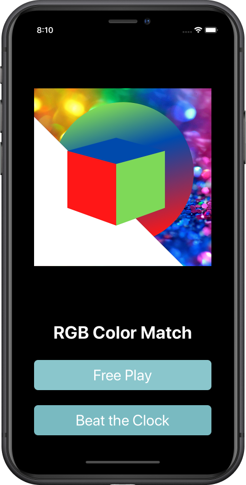
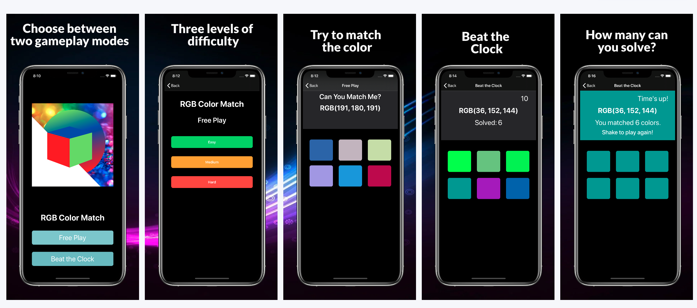

<nav class="navbar navbar-expand-lg navbar-light bg-light">[RGB Matcher](index.html)<button class="navbar-toggler" type="button" data-toggle="collapse" data-target="#navbarColor01" aria-controls="navbarColor01" aria-expanded="false" aria-label="Toggle navigation"></button>

- [Home](index.html)
- [Privacy Policy](privacypolicy.html)

</nav>

<header class="masthead">

# RGB Matcher is a fun, challenging color matching game

</header>

<section class="download bg-blue text-center" id="download">

## Can you match the color?

### RGB Matcher is available only the App Store! Download now to play!

</section>

<footer>

© RGB Matcher. All Rights Reserved.

- [Privacy](privacypolicy.md)

</footer>
